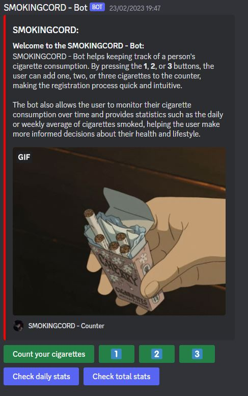

<div id="top" align="center">

[![Contributors][contributors-shield]][contributors-url]
[![Forks][forks-shield]][forks-url]
[![Stargazers][stars-shield]][stars-url]
[![Issues][issues-shield]][issues-url]
[![LinkedIn][linkedin-shield]][linkedin-url]
  
</div>
<!-- APP LOGO -->
<br />
<div align="center">

  <h3 align="center">SmokingCord</h3>

  <p align="center">
    SmokingCord is a Discord bot that helps you track the number of cigarettes you smoke, providing daily and total stats, and offering helpful resources and tips to quit smoking.
    <br />
    <a href="https://github.com/MarianoAkaMery/smoking-cord"><strong>Explore the docs »</strong></a>
    <br />
    <br />
    <a href="https://github.com/MarianoAkaMery/smoking-cord">View Demo</a>
    ·
    <a href="https://github.com/MarianoAkaMery/smoking-cord/issues">Report Bug</a>
    ·
    <a href="https://github.com/MarianoAkaMery/smoking-cord/issues">Request Feature</a>
  </p>
</div>

<!-- ABOUT THE PROJECT -->
## About The Project
<div align="center">
  <a href="https://github.com/MarianoAkaMery/smoking-cord">
    
  </a>
</div>


SmokingCord is an innovative and user-friendly Discord bot that is designed to help you keep track of the number of cigarettes you smoke on a daily basis. This bot is perfect for people who want to cut back on their smoking or quit smoking altogether.

With SmokingCord, you can log your smoking sessions by simply clicking a button. You can then input the number of cigarettes you smoked, or you can use the convenient one-click options to add 1, 2, or 3 cigarettes to your log.

SmokingCord also provides you with daily stats and total stats, so you can see your progress over time. You can use these stats to motivate yourself to quit smoking or to track your progress as you cut back. The bot makes it easy to see how many cigarettes you have smoked, how much money you have saved, and how many hours of your life you have regained by not smoking.

In addition to tracking your smoking habits, SmokingCord also provides helpful resources and tips to help you quit smoking. With this bot, you can take control of your smoking habits and make positive changes in your life.

<p align="right">(<a href="#top">back to top</a>)</p>

### Built With

SmokingCord is a discord bot developed in python, libraries and plugins were used to build it:

* [interactions.py](https://github.com/interactions-py)
* [MongoDB](https://www.mongodb.com/it-it)
* [PyMongo](https://pypi.org/project/pymongo/)


<p align="right">(<a href="#top">back to top</a>)</p>

<!-- GETTING STARTED -->
## Getting Started

To simply add the bot to your server, you can easily click [Here](https://discord.com/api/oauth2/authorize?client_id=1076534348041424936&permissions=8&scope=bot%20applications.commands). 
If, on the other hand, you want to install the project locally in your work environment, you have to meet some prerequisites.

### Prerequisites

Here is a short list of the requirements you must meet in order to compile the project locally:
* Python Installed
* Install all the libraries in [requirements.txt](https://github.com/MarianoAkaMery/smoking-cord/blob/main/requirements.txt)

### Installation

_Here is an example of the steps to follow to install and build the project locally_:

1. Create an account on [MongoDB](https://www.mongodb.com/it-it) and setup your free databases

2. Clone the repo
   ```sh
   git clone [https://github.com/MarianoAkaMery/smoking-cord](https://github.com/MarianoAkaMery/smoking-cord)
   ```
   
3. Go to [DiscordDeveloperPortal](https://discord.com/developers/applications) and create your application + bot

4. Enter your token key in an `SmokingCord.oy` file in the project root
   ```sh
   bot = interactions.Client(
    token="XXXXXXXXXXXXXXXXXXX",
   ```
5. Invite the bot in your server and have fun with it!

<p align="right">(<a href="#top">back to top</a>)</p>


<!-- LICENSE -->
## License

Distributed under the Creative Commons Attribution-NonCommercial-NoDerivatives 4.0 International License. See `LICENSE.md` for more information.

<p align="right">(<a href="#top">back to top</a>)</p>


<!-- MARKDOWN LINKS & IMAGES -->
<!-- https://www.markdownguide.org/basic-syntax/#reference-style-links -->
[contributors-shield]: https://img.shields.io/github/contributors/MarianoAkaMery/smoking-cord.svg?style=for-the-badge
[contributors-url]: https://github.com/MarianoAkaMery/smoking-cord/graphs/contributors
[forks-shield]: https://img.shields.io/github/forks/MarianoAkaMery/smoking-cord.svg?style=for-the-badge
[forks-url]: https://github.com/MarianoAkaMery/smoking-cord/network/members
[stars-shield]: https://img.shields.io/github/stars/MarianoAkaMery/smoking-cord.svg?style=for-the-badge
[stars-url]: https://github.com/MarianoAkaMery/smoking-cord/stargazers
[issues-shield]: https://img.shields.io/github/issues/MarianoAkaMery/smoking-cord.svg?style=for-the-badge
[issues-url]: https://github.com/MarianoAkaMery/smoking-cord/issues
[linkedin-shield]: https://img.shields.io/badge/-LinkedIn-black.svg?style=for-the-badge&logo=linkedin&colorB=555
[linkedin-url]: [https://linkedin.com/in/othneildrew](https://www.linkedin.com/in/salvatore-mariano-librici-0aaab3202/)
